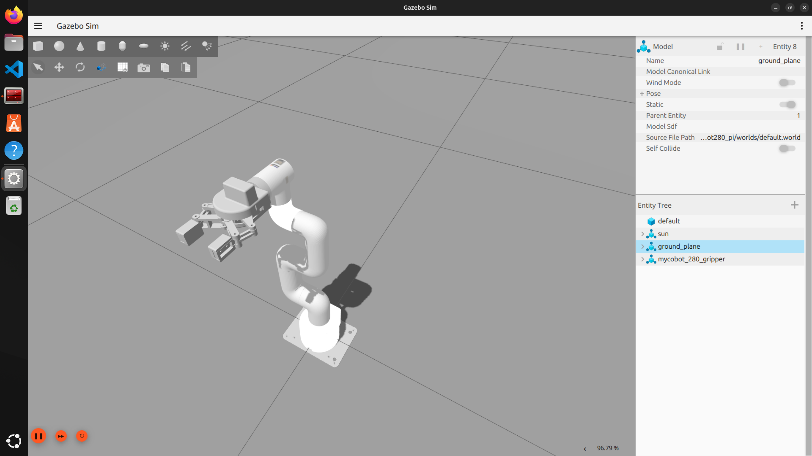
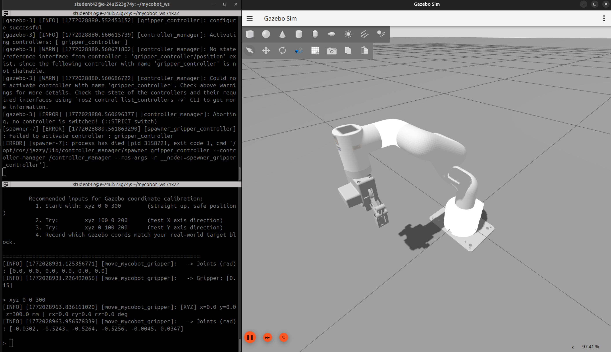

# Manipulator Control / MyCobot 280 Pi Control Package

**This package is still in development.**
ROS2 control package used for MyCobot 280pi Manipulator. Supports RViz visualization, Gazebo simulation and real hardware control.

## Features

- 🤖 Supports MyCobot 280 Pi Manipulator (with Adaptive Gripper)
- 📊 RViz visualization simulation
- 🌍 Gazebo physics simulation (with and without gripper)
- 🎮 Pick and Place demonstration
- 🔄 Mock mode local testing (no hardware required)
- 📡 ROS 2 distributed control (supports WiFi communication)
- 🐍 Compatible with pymycobot API

## Package Structure

```
my_cobot_control    -- RViz Control Package
mycobot_ros2        -- Official ROS 2 Package for myCobot Manipulator (URDF)
mycobot280_pi       -- Gazebo Simulation Package (mltejas88/Project_Mycobot_280pi_simulation)
```

## System Requirements

- **Operating System**: Ubuntu 22.04 / 24.04
- **ROS 2**: Jazzy (or Humble)
- **Python**: 3.12+
- **Dependencies**:
  - `pymycobot` (hardware control & inverse kinematics)
  - `mycobot_ros2` (official URDF model and ROS 2 integration)
  - `gazebo` / `gz-sim` (Gazebo simulation)
  - `ros-$ROS_DISTRO-gazebo-ros-pkgs` (Gazebo ROS bridge)
  - `ros-$ROS_DISTRO-joint-state-publisher`
  - `ros-$ROS_DISTRO-robot-state-publisher`
  - `ros-$ROS_DISTRO-controller-manager`
  - `ros-$ROS_DISTRO-ros2-control`
  - `ros-$ROS_DISTRO-ros2-controllers`

## Installation Steps

### 1. Create Workspace

```bash
mkdir -p ~/mycobot_ws/src
cd ~/mycobot_ws/src
```

### 2. Clone Repository

```bash
# Clone this package
git clone https://github.com/YOUR_USERNAME/my_cobot_control.git

# Clone the official mycobot_ros2 package (provides URDF model)
# The official repository only supports Humble, but you can try to use it in Jazzy as well.
git clone -b humble https://github.com/elephantrobotics/mycobot_ros2.git

# The Gazebo simulation package (already included in this repo)
# Source: https://github.com/mltejas88/Project_Mycobot_280pi_simulation
```

### 3. Build Workspace and Virtual Environment

```bash
cd ~/mycobot_ws
python3 -m venv venv_mycobot
source venv_mycobot/bin/activate

# Install PyMyCobot API (for hardware control & IK)
pip install pymycobot

# If you want to install from source:
# git clone https://github.com/elephantrobotics/pymycobot.git
# pip install ./pymycobot
```

> **Note:** The virtual environment is required to avoid conflicts between `pymycobot` and ROS 2 Python dependencies. Always activate it before running scripts that use `pymycobot`.

### 4. Build ROS 2 Packages

```bash
cd ~/mycobot_ws
colcon build --packages-select mycobot280_pi mycobot_description
# Or build all packages
colcon build --symlink-install
source install/setup.bash
```

---

## Usage

### 1. Run RViz Simulation

```bash
source ~/mycobot_ws/install/setup.bash
ros2 launch my_cobot_control pick_and_place_demo.launch.py
```

This will:
1. Launch RViz to display the MyCobot 280 model (with Adaptive Gripper)
2. Loop pick and place presentation

---

### 2. Run Gazebo Simulation

#### 2.1 Without Gripper

```bash
# Terminal 1 — Start Gazebo simulation
ros2 launch mycobot280_pi mycobot.launch.py

# Terminal 2 — Run control script
ros2 run mycobot280_pi move_mycobot.py
```

#### 2.2 With Gripper

```bash
# Start Gazebo simulation with gripper
ros2 launch mycobot280_pi mycobot_gripper.launch.py
```

You should see the gripper in Gazebo like this:



Run the gripper control script:

**Interactive mode (default)** — used for Gazebo coordinate calibration:
```bash
ros2 run mycobot280_pi move_mycobot_gripper.py
```



**Automatic task mode:**
```bash
ros2 run mycobot280_pi move_mycobot_gripper.py --auto
```

**Kill all Gazebo processes (clean exit):**
```bash
killall -9 ruby gz
```

---

### 3. Hardware Control with RViz Feedback

**Terminal 1** — Start RViz Node (connect to hardware):
```bash
ros2 launch mycobot_280pi test.launch.py
```

**Terminal 2** — Start Pick and Place Demo node:
```bash
ros2 run my_cobot_control pick_and_place_with_feedback
```

---

## Notes on Inverse Kinematics in Gazebo

The `pymycobot` API (`from pymycobot import MyCobot280`) provides built-in inverse kinematics. You can use it to convert Cartesian coordinates `(x, y, z)` to joint angles for Gazebo simulation **without** connecting to real hardware. This is the recommended approach for coordinate-to-angle conversion in simulation.

The workflow is:
1. Receive target `(x, y, z)` coordinates via ROS 2 topic (from depth camera + object detection)
2. Use `pymycobot` IK to compute joint angles
3. Send joint angles to Gazebo controllers via ROS 2 topics
4. Apply same pipeline to real hardware for deployment

